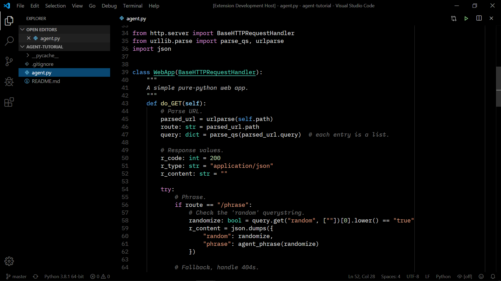

Dark+ Black
===========

VS Code theme based on the default “Dark+” theme, modified to be pure black.

There are also a couple minor syntax highlighting enhancements including:

* Underline class names
* Italic comments (excluding open/close comment tokens)
* Dim grey colored comments
* Brighter grey colored docstring and block comments.

Looks great with a font with pretty italics, such as:

* [IBM Plex Mono](https://www.ibm.com/plex/)
* [Cascadia Code](https://github.com/microsoft/cascadia-code)
* [Courier Prime](https://quoteunquoteapps.com/courierprime/)
* Or if you're *really* classy... [Computer Modern Typewriter](https://www.checkmyworking.com/cm-web-fonts/#typewriter). Check out those italics!

Links:
* [GitHub repository](https://github.com/vsalvino/dark-plus-black)
* [Install in VS Code](https://marketplace.visualstudio.com/items?itemName=VinceSalvino.dark-plus-black)
